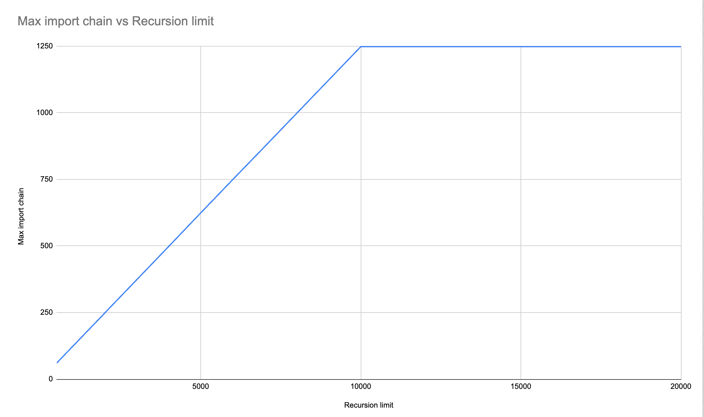

# Import Recursion Demo

This repository demonstrates how max recursion depth errors are triggered by long chains of imports in a Python project.

It shows how a chain of imports (i.e. one module imports another, which imports another, which imports another) will
cause a `RecursionError` to be raised if the Python recursion limit is not high enough.
The relationship appears to be linear, and for every additional import in the chain the recursion limit needs to be
raised by around 8. 

# System dependencies

This project requires [uv](https://docs.astral.sh/uv/) to be installed.

# Generation script

Demo python projects are generated by the `generate_project.py` script. This can be run as follows:

```
uv run generate_project.py
```

Or:

`uv run generate.py --project-name=demo --chain-length=150 --recursion-limit=1000`

## Optional arguments

- `--project-name`: The name of the project, created under `src/{project_name}`. If a project of that name
                      already exists, it will be overwritten. Default: `demo`.
- `--chain-length`: The length of the import chain triggered by running `main.py`. Default: 150.
- `--recursion-limit`: The Python recursion limit that will be set before triggering the import chain. Default: 1000.

## Generated project structure

The generated project has this structure:

```
demo
├── __init__.py
├── main.py
├── mod_001.py
├── mod_002.py
├── mod_003.py
├── ...
└── mod_nnn.py
```

Where nnn is the import chain length.

The entry point is `main.py`. This sets the max recursion limit and then imports `mod_001.py`.

Each numbered module imports the module named with the next number. For example, `mod_010.py`
would import `mod_011.py`. The final module to be imported prints a message.

# Triggering the import chain

Once a project has been generated, run it using `uv run src/{project_name}/main.py`. 

Depending on the values of the recursion limit and chain length, `RecursionError` may be raised. The number of the
module from which the error was raised shows how long the import chain was before the recursion limit was hit.

## Specifying the Python version

UV supports running the project with a specific Python version like this: 

`uv run --python 3.12.7 src/{project_name}/main.py`

# Analysis

Running this script in CPython 3.12.7 for various recursion limits shows a linear relationship between the
recursion limit and the maximum chain of imports.  

| Recursion limit | Max import chain |
|-----------------|------------------|
| 500             | 61               |
| 600             | 74               |
| 700             | 86               |
| 800             | 99               |
| 900             | 111              |
| 1000            | 124              |
| 1100            | 136              |
| 1200            | 149              |
| 1300            | 161              |
| 1400            | 174              |
| 1500            | 186              |
| 1600            | 199              |
| 1700            | 211              |
| 1800            | 224              |
| 1900            | 236              |
| 2000            | 249              |
| 3000            | 374              |
| 4000            | 499              |
| 5000            | 625              |
| 6000            | 750              |
| 7000            | 874              |
| 8000            | 999              |
| 9000            | 1124             |
| 10000           | 1249             |



This suggests that the following formula applies for import chains in the range 61 - 1,249, for Python 3.12.7:

_Minimum required recursion limit ~= 8 x import chain length + 18_

## Other Python versions

Spot checks of other CPython versions suggests that prior to 3.12 a slightly higher recursion limit is needed.

| CPython version | Max import chain with a recursion limit of 1000 |
|-----------------|------------------------------------------------|
| 3.8             | 99                                             |
| 3.9             | 99                                             |
| 3.10            | 99                                             |
| 3.11            | 99                                             |
| 3.12            | 124                                            |
| 3.13            | 124                                            |
